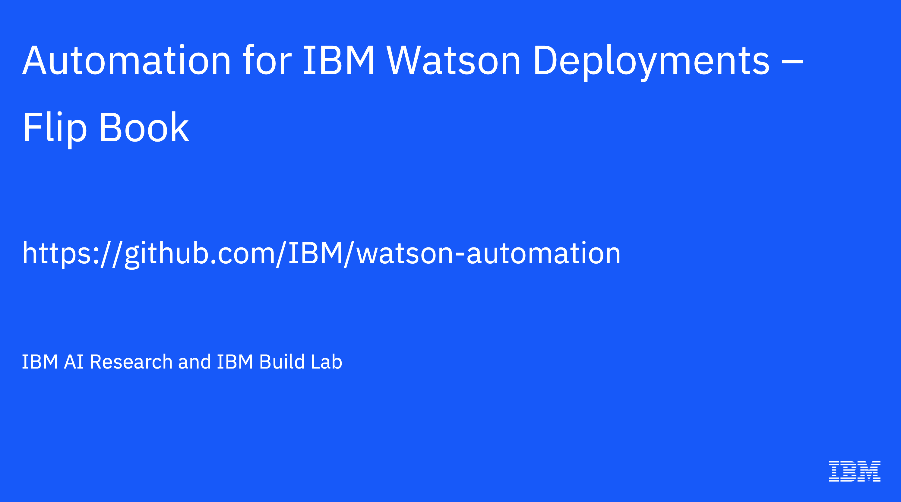

# Automation for IBM Watson Deployments

[Automation for IBM Watson Deployments](https://github.com/ibm/watson-automation) (this repo) contains samples and documentation how to create managed OpenShift clusters on the IBM Cloud, how to deploy Watson NLP containers and how to access them from custom applications. With an IBM Cloud account a full production sample can be deployed in roughly one hour.

🔴 IMPORTANT: At this point this functionality is experimental only and subject to change.

Key Technologies:

- [IBM Watson NLP](https://www.ibm.com/docs/en/watson-libraries?topic=watson-natural-language-processing-library-embed-home) (Natural Language Processing) comes with a wide variety of text processing functions, such as emotion analysis and topic modeling. Watson NLP is built on top of the best AI open source software. Additionally it provides stable and supported interfaces, it handles a wide range of languages and its quality is enterprise proven. The cloud-native Watson NLP containers can be deployed on various Kubernetes-based platforms.
- [IBM Technology Zone Accelerator Toolkit](https://operate.cloudnativetoolkit.dev/) is an opinionated open source framework on top of the standard technologies Terraform and ArgoCD. The toolkit allows automating deployments and operations of infrastructure like Red Hat OpenShift clusters and applications.

## Happy Path

The steps below describe the 'happy path' for developers and operation engineers to deploy a simple Watson NLP scenario on OpenShift as easily as possible. At the end of the happy path the following infrastructure, service and application components will have been deployed:

1. Managed OpenShift cluster on the IBM Cloud on VPC ([screenshot](documentation/screenshots/ibm-cloud-01.png))
2. ArgoCD running in the OpenShift cluster ([screenshot](documentation/screenshots/argocd-03.png))
3. Watson NLP pod ([screenshot](documentation/screenshots/openshift-03.png))

   - Runtime container which provides gRCP and REST interfaces via a service
   - One model container for syntax predictions

4. Sample consumer application pod ([screenshot](documentation/screenshots/openshift-08.png))

   - UBI container which is configured to run a command which invokes the Watson NLP runtime container via REST

5. Snippets to invoke Watson NLP via gRCP and REST from a local environment ([screenshot](documentation/screenshots/validation-01.png))

The following [flip book](documentation/Flip_Book_-_Automation_for_IBM_Watson_Deployments.pdf) contains screenshots that describes the setup as well as the results.

[](documentation/Flip_Book_-_Automation_for_IBM_Watson_Deployments.pdf)

## Outline

- [Setup - Happy Path](#setup)
  - [Prerequisites](#prerequisites)
  - [Instructions](#instructions)
  - [Usage](#usage)
- [Setup - Advanced](documentation/Usage.md)
  - [Watson NLP Images and Registries](documentation/Usage.md#watson-nlp-images-and-registries)
  - [Usage of existing Clusters](documentation/Usage.md#usage-of-existing-clusters)
  - [Docker Alternatives](documentation/Usage.md#docker-alternatives)
  - [Best Practices](documentation/Usage.md#best-practices)
- [Watson NLP Helm Chart](documentation/NLPHelmChart.md)
- [Development](documentation/Development.md)
- [Resources](#resources)

## Setup

The following parts describes the prerequisites, setup instructions and basic usage and validation.

### Prerequisites

You need the following prerequisites:

1. Docker
2. IBM id and IBM Cloud (paid) account
3. `iascable` CLI (toolkit CLI)
4. Watson entitlement key (you can use a trial)
5. GitHub.com access token
6. `grcpcurl`
7. `oc`

#### **1. Docker**

Docker is needed for the instructions below. Alternatively Multipass can be used (see [documentation](documentation/Usage.md#docker-alternatives)).

#### **2. IBM id and IBM Cloud (paid) account**

Register on [IBM Cloud](https://cloud.ibm/registration) and enter your payment information. Next create an [IBM Cloud API key](https://www.ibm.com/docs/en/app-connect/containers_cd?topic=servers-creating-cloud-api-key).

#### **3. `iascable` CLI**

`iascable` is the IBM Technology Zone Accelerator Toolkit CLI. Install `iascable` 2.25.4 or later.

```sh
curl -sL https://iascable.cloudnativetoolkit.dev/install.sh | sh
iascable --version
```

If you encounter the error `zsh: killed` on Apple M1, this is due to an issue with the `iascable` binary. As a temporary workaround, install `iascable` using an alternative approach.

If not already installed, install `npm`:

```sh
brew install npm
```

Install `iascable` via `npm`:

```sh
sudo -i rm /usr/local/bin/iascable
npm install -g @cloudnativetoolkit/iascable
```

#### **4. Watson NLP trial entitlement key**

An [entitlement key](https://www.ibm.com/account/reg/us-en/subscribe?formid=urx-51726) is needed.

#### **5. GitHub.com access token**

Create an [access token on GitHub.com](https://docs.github.com/en/authentication/keeping-your-account-and-data-secure/creating-a-personal-access-token).

#### **6. `grcpurl`**

Install [grcpurl](https://github.com/fullstorydev/grpcurl).

#### **7. `oc`**

Install [`oc`](https://docs.openshift.com/container-platform/4.7/cli_reference/openshift_cli/getting-started-cli.html).

### Instructions

The following steps need to be performed:

1. Clone repo
2. Understand the BOM (bill of materials)
3. Define `variables.yaml`
4. Define `credentials.properties`
5. Run `iascable build`
6. Apply Terraform modules

#### **1. Clone repo**

```sh
git clone https://github.com/ibm/watson-automation
cd watson-automation/roks-new-nlp
```

#### **2. Understand BOM (bill of materials)**

The bill of materials ([`bom.yaml`](`roks-new-nlp/bom.yaml`)) contains the [Technology Zone Accelerator Toolkit modules](https://modules.cloudnativetoolkit.dev/) that will be deployed: OpenShift, ArgoCD, Watson NLP and an UBI container.

Note: You don't have to change this file.

```yaml
spec:
  modules:
    - name: ibm-vpc
      version: v1.17.0
    - name: ibm-vpc-subnets
      version: v1.14.0
    - name: ibm-vpc-gateways
      version: v1.10.0
    - name: ibm-ocp-vpc
      version: v1.16.0
    - name: ibm-object-storage
      version: v4.1.0
    - name: argocd-bootstrap
      version: v1.12.0
    - name: gitops-repo
      alias: gitops_repo
      version: v1.22.2
    - name: terraform-gitops-ubi
      alias: terraform_gitops_ubi
      version: v0.0.8
    - name: terraform-gitops-watson-nlp
      alias: terraform_gitops_watson_nlp
      version: v0.0.80
```

The bill of material can be used by different consumers. Consumer specific variables need to be defined in `variables.yaml` and `credentials.properties`.

#### **3. Define `variables.yaml`**

Create `output/cluster-with-watson-nlp/variables.yaml` based on [`output/cluster-with-watson-nlp/variables-template.yaml`](roks-new-nlp/output/cluster-with-watson-nlp/variables-template.yaml).

```sh
cp output/cluster-with-watson-nlp/variables-template.yaml output/cluster-with-watson-nlp/variables.yaml
vi output/cluster-with-watson-nlp/variables.yaml
```

Define the variables in `variables.yaml`. If not done, you will get prompted later. Replace all 'xxx' occurances. You must also change 'terraform_gitops_watson_nlp_accept_license' from false to true.

```yaml
variables:
  # overall
  - name: region
    description: The IBM Cloud region where the instance should be provisioned
    value: xxx
  - name: resource_group_name
    description: The name of the IBM Cloud resource group where the resources should be provisioned
    value: xxx
  - name: common_tags
    description: The list of tags that should be applied to all resources (does not work)
    value: []

  # vpc
  - name: ibm-vpc-subnets__count
    description: The number of subnets that should be created in the VPC
    value: 1

  # ocp
  - name: worker_count
    description: The number of workers that should be provisioned per subnet
    value: 2
  - name: cluster_flavor
    description: The flavor of the worker nodes that will be provisioned
    value: bx2.4x16

  # namespace
  - name: namespace_name
    description: The name of the namespace that will be created within the cluster
    value: watson-demo

  # gitops
  - name: gitops_repo_repo
    description: The name of the gitops repository that will be created
    value: xxx
  - name: gitops_repo_host
    value: github.com
  - name: gitops_repo_org
    value: xxx
  - name: gitops_repo_username
    value: xxx

  # nlp
  - name: terraform_gitops_watson_nlp_runtime_image
    value: watson-nlp-runtime:1.0.18
  - name: terraform_gitops_watson_nlp_runtime_registry
    value: watson
  - name: terraform_gitops_watson_nlp_accept_license
    value: false
  - name: terraform_gitops_watson_nlp_imagePullSecrets
    value:
      - ibm-entitlement-key
  - name: terraform_gitops_watson_nlp_models
    value:
      - registry: watson
        image: watson-nlp_syntax_izumo_lang_en_stock:1.0.6
  - name: terraform_gitops_watson_nlp_registries
    value:
      - name: watson
        url: cp.icr.io/cp/ai
  - name: terraform_gitops_watson_nlp_registryUserNames
    value:
      - registry: watson
        userName: cp

  # ubi
  - name: terraform_gitops_ubi_command
    value: echo 'helloworld'
```

#### **4. Define credentials.properties**

Create `output/credentials.properties` based on [`output/credentials-template.properties`](roks-new-nlp/output/credentials-template.properties).

```sh
cp output/credentials-template.properties output/credentials.properties
vi output/credentials.properties
```

You need to define three credentials:

- GitHub.com access token
- IBM Cloud API key
- Watson entitlement key

```sh
export TF_VAR_gitops_repo_token=xxx
export TF_VAR_ibmcloud_api_key=xxx
export TF_VAR_terraform_gitops_watson_nlp_registry_credentials=xxx
```

#### **5. Run `iascable` build**

Use `iascable` to create the Terraform code.

```sh
cd watson-deployments/roks-new-nlp
iascable build -i bom.yaml
cd output
```

#### **6. Apply Terraform modules**

An image is provided which comes with all tools necessary to run Terraform. To start the container, invoke this command in a terminal:

```sh
./launch.sh
```

In the running container invoke these commands:

```sh
cd cluster-with-watson-nlp
./apply.sh
```

Note: Be patient. Running `apply.sh` takes roughly 45 minutes.

🔴 IMPORTANT: Timing issues can occur and you get errors. In this case wait a couple of minutes and run the same script again. In some cases you need three attempts.

## Usage

Once the Watson NLP pod and the UBI pods are running, gRPC and REST can be used to run predictions using the simple syntax model.

Log in to OpenShift and forward port(s). Execute the following commands in a first terminal window. Set the port to 8080 for REST or 8085 for gRPC.

```sh
ibmcloud login --sso
ibmcloud target -g RESOURCE_GROUP # e.g. ibmcloud target -g niklas
ibmcloud target -r REGION # e.g. ibmcloud target -r eu-gb
ibmcloud ks cluster ls
ibmcloud oc cluster config -c CLUSTER --admin # e.g. ibmcloud oc cluster config -c niklas-cluster --admin
```

or

```sh
oc login --token=sha256~xxx --server=https://xxx
```

To get the OpenShift login token, open the OpenShift console, click on your user name in the upper right corner and choose 'copy login command'.

```sh
YOUR_NAMESPACE=watson-demo
WATSON_SERVICE=$(oc get services -n $YOUR_NAMESPACE | grep "watson" |  awk '{print $1;}')
oc port-forward svc/$WATSON_SERVICE -n $YOUR_NAMESPACE 8085
```

### gRPC

Execute the following command in a second terminal window.

```sh
git clone https://github.com/IBM/ibm-watson-embed-clients
cd ibm-watson-embed-clients/watson_nlp/protos
grpcurl -plaintext -proto common-service.proto -d '{
"raw_document": {
"text": "It is so easy to embed Watson NLP in applications. Very cool"
},
"parsers": ["token"]
}' -H 'mm-model-id: syntax_izumo_lang_en_stock' localhost:8085 watson.runtime.nlp.v1.NlpService.SyntaxPredict
```

Expected output:

```json
{
  "text": "It is so easy to embed Watson NLP in applications. Very cool",
  "producerId": {
    "name": "Izumo Text Processing",
    "version": "0.0.1"
  },
  "tokens": [
    {
      "span": {
        "end": 2,
        "text": "It"
      }
    },
...
  ],
  "sentences": [
    {
      "span": {
        "end": 50,
        "text": "It is so easy to embed Watson NLP in applications."
      }
    },
    {
      "span": {
        "begin": 51,
        "end": 60,
        "text": "Very cool"
      }
    }
  ],
  "paragraphs": [
    {
      "span": {
        "end": 60,
        "text": "It is so easy to embed Watson NLP in applications. Very cool"
      }
    }
  ]
}
```

### REST

Execute the following command in another terminal window.

```sh
curl -X POST "http://localhost:8080/v1/watson.runtime.nlp.v1/NlpService/SyntaxPredict" \
  -H "accept: application/json" \
  -H "grpc-metadata-mm-model-id: syntax_izumo_lang_en_stock" \
  -H "content-type: application/json" \
  -d " { \"rawDocument\": { \"text\": \"It is so easy to embed Watson NLP in applications. Very cool.\" }}"
```

Expected output:

```json
{
  "text": "It is so easy to embed Watson NLP in applications. Very cool.",
  "producerId": { "name": "Izumo Text Processing", "version": "0.0.1" },
  "tokens": [
    {
      "span": { "begin": 0, "end": 2, "text": "It" },
      "lemma": "",
      "partOfSpeech": "POS_UNSET",
      "dependency": null,
      "features": []
    },
    {
      "span": { "begin": 3, "end": 5, "text": "is" },
      "lemma": "",
      "partOfSpeech": "POS_UNSET",
      "dependency": null,
      "features": []
    },
    {
      "span": { "begin": 6, "end": 8, "text": "so" },
      "lemma": "",
      "partOfSpeech": "POS_UNSET",
      "dependency": null,
      "features": []
    },
    {
      "span": { "begin": 9, "end": 13, "text": "easy" },
      "lemma": "",
      "partOfSpeech": "POS_UNSET",
      "dependency": null,
      "features": []
    },
    {
      "span": { "begin": 14, "end": 16, "text": "to" },
      "lemma": "",
      "partOfSpeech": "POS_UNSET",
      "dependency": null,
      "features": []
    },
    {
      "span": { "begin": 17, "end": 22, "text": "embed" },
      "lemma": "",
      "partOfSpeech": "POS_UNSET",
      "dependency": null,
      "features": []
    },
    {
      "span": { "begin": 23, "end": 29, "text": "Watson" },
      "lemma": "",
      "partOfSpeech": "POS_UNSET",
      "dependency": null,
      "features": []
    },
    {
      "span": { "begin": 30, "end": 33, "text": "NLP" },
      "lemma": "",
      "partOfSpeech": "POS_UNSET",
      "dependency": null,
      "features": []
    },
    {
      "span": { "begin": 34, "end": 36, "text": "in" },
      "lemma": "",
      "partOfSpeech": "POS_UNSET",
      "dependency": null,
      "features": []
    },
    {
      "span": { "begin": 37, "end": 49, "text": "applications" },
      "lemma": "",
      "partOfSpeech": "POS_UNSET",
      "dependency": null,
      "features": []
    },
    {
      "span": { "begin": 49, "end": 50, "text": "." },
      "lemma": "",
      "partOfSpeech": "POS_UNSET",
      "dependency": null,
      "features": []
    },
    {
      "span": { "begin": 51, "end": 55, "text": "Very" },
      "lemma": "",
      "partOfSpeech": "POS_UNSET",
      "dependency": null,
      "features": []
    },
    {
      "span": { "begin": 56, "end": 60, "text": "cool" },
      "lemma": "",
      "partOfSpeech": "POS_UNSET",
      "dependency": null,
      "features": []
    },
    {
      "span": { "begin": 60, "end": 61, "text": "." },
      "lemma": "",
      "partOfSpeech": "POS_UNSET",
      "dependency": null,
      "features": []
    }
  ],
  "sentences": [
    {
      "span": {
        "begin": 0,
        "end": 50,
        "text": "It is so easy to embed Watson NLP in applications."
      }
    },
    { "span": { "begin": 51, "end": 61, "text": "Very cool." } }
  ],
  "paragraphs": [
    {
      "span": {
        "begin": 0,
        "end": 61,
        "text": "It is so easy to embed Watson NLP in applications. Very cool."
      }
    }
  ]
}
```

Open [Swagger](http://localhost:8080/swagger/).

## Resources

- IBM Watson NLP
  - [IBM Helps Ecosystem Partners Accelerate AI Adoption by Making it Easier to Embed and Scale AI Across Their Business](https://newsroom.ibm.com/2022-10-25-IBM-Helps-Ecosystem-Partners-Accelerate-AI-Adoption-by-Making-it-Easier-to-Embed-and-Scale-AI-Across-Their-Business)
  - [Documentation](https://www.ibm.com/docs/en/watson-libraries?topic=watson-natural-language-processing-library-embed-home)
  - [Watson NLP Helm Chart](https://github.com/cloud-native-toolkit/terraform-gitops-watson-nlp/tree/main/chart/watson-nlp)
  - [Syntax model](https://www.ibm.com/docs/en/watson-libraries?topic=catalog-syntax)
  - [Samples](https://github.com/ibm-build-labs/Watson-NLP)
- IBM Technology Zone Accelerator Toolkit
  - [Documentation](https://operate.cloudnativetoolkit.dev/)
  - [Modules](https://modules.cloudnativetoolkit.dev/)
  - [CLI](https://github.com/cloud-native-toolkit/iascable)
  - [Watson NLP Module](https://github.com/cloud-native-toolkit/terraform-gitops-watson-nlp)
  - [UBI Module](https://github.com/cloud-native-toolkit/terraform-gitops-ubi)
  - Labs
    - [Lab 1: Basics](https://operate.cloudnativetoolkit.dev/learn/iascable/lab1/)
    - [Lab 2: Terraform](https://operate.cloudnativetoolkit.dev/learn/iascable/lab2/)
    - [Lab 3: GitOps](https://operate.cloudnativetoolkit.dev/learn/iascable/lab3/)
    - [Lab 4: Create UBI module](https://operate.cloudnativetoolkit.dev/learn/iascable/lab4/)
- Embeddeable AI
  - [PartnerWorld](https://www.ibm.com/partnerworld/program/embeddableai)
  - [Watson Natural Language Processing Library for Embed](https://www.ibm.com/products/ibm-watson-natural-language-processing)
  - [IBM Digital Self-Serve Co-Create Experience for Embeddable AI](https://dsce.ibm.com/)
- IBM Technology Zone assets
  - [Automation for IBM Watson Deployments](https://techzone.ibm.com/collection/automation-for-ibm-watson-deployments)
  - [Watson NLP - Text Classification](https://techzone.ibm.com/collection/watson-nlp-text-classification)
  - [Watson NLP - Entities & Keywords extraction](https://techzone.ibm.com/collection/watson-nlp-entities-keywords-extraction)
  - [Watson NLP - Topic Modeling](https://techzone.ibm.com/collection/watson-nlp-topic-modeling)
  - [Watson NLP - Sentiment and Emotion Analysis](https://techzone.ibm.com/collection/watson-core-nlp)
  - [Embeddable AI](https://techzone.ibm.com/collection/embedded-ai)
  - [Watson NLP - Creating Client Applications](https://techzone.ibm.com/collection/watson-nlp-creating-client-applications)
  - [Watson NLP - Serving Models with Standalone Containers](https://techzone.ibm.com/collection/watson-nlp-serving-models-with-standalone-containers)
  - [Watson NLP - Serving Models with Kubernetes and OpenShift](https://techzone.ibm.com/collection/watson-nlp-serving-nlp-models)
